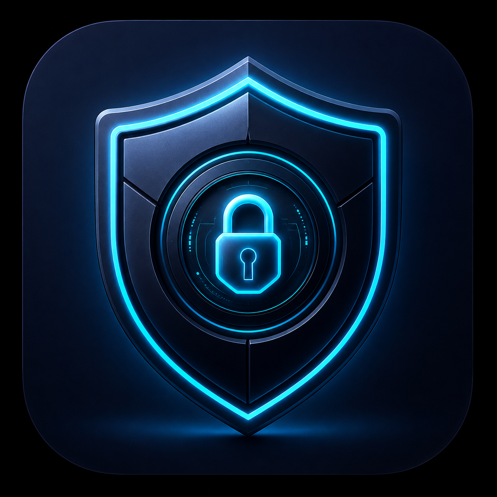

# 🔑 Ghost Nexora VPN

<div align="center">


**Gestión profesional de perfiles VPN para Android**


*Desarrollado por [Ghost Developer](https://github.com/CHICO-CP)*

</div>

---

## 📱 ¿Qué es Ghost Nexora VPN?

**Ghost Nexora VPN** es una aplicación Android nativa que permite gestionar perfiles de
conexión VPN de forma moderna, centralizada y segura. Diseñada con una experiencia similar
a las VPN comerciales premium, pero con código abierto y total control del usuario.

A diferencia de los gestores convencionales, Ghost Nexora ofrece importación/exportación
de perfiles en JSON, creación manual con soporte para múltiples protocolos, dashboard
reactivo con estados visuales en tiempo real y ejecución persistente en segundo plano
mediante la API oficial `VpnService` de Android.

---

## ✨ Características principales

| Característica | Descripción |
|---|---|
| 🔑 **Gestión de perfiles** | Crear, editar, eliminar y organizar perfiles VPN con etiquetas |
| 📥 **Importar / Exportar** | Soporte completo para JSON con previsualización y merge/replace |
| 🔒 **VPN nativa** | Interfaz TUN real mediante `VpnService` de Android |
| 🫧 **Ventana flotante** | Burbuja de control rápido sobre otras aplicaciones |
| 📊 **Dashboard reactivo** | Estados en tiempo real con animaciones y timer de sesión |
| 📋 **Registro de logs** | Historial completo con filtros por nivel y búsqueda |
| ⚙️ **Ajustes avanzados** | Reconexión automática, gestión de permisos, limpieza de datos |
| 🌙 **Tema oscuro neon** | Material Design 3 con acentos cian/azul/verde |
| 🔔 **Notificación persistente** | Control desde la barra de notificaciones |
| 🚀 **Reconexión al inicio** | Conecta automáticamente al encender el dispositivo |

---

## 🛠️ Stack tecnológico

```
Lenguaje:     Kotlin 2.0
UI:           Jetpack Compose + Material Design 3
Arquitectura: MVVM + Repository Pattern + StateFlow
DI:           Hilt (Dagger)
Base de datos: Room (SQLite)
Preferencias: DataStore (Proto)
Serialización: Gson
VPN:          VpnService (TUN interface)
Overlay:      WindowManager (TYPE_APPLICATION_OVERLAY)
Background:   Foreground Service + START_STICKY
```

---

## 📂 Estructura del proyecto

```
GhostNexoraVPN/
├── app/
│   └── src/main/
│       ├── java/com/ghostnexora/vpn/
│       │   ├── data/
│       │   │   ├── model/          # VpnProfile, LogEntry, ConnectionState
│       │   │   ├── local/          # Room DAOs, AppDatabase, DataStoreManager
│       │   │   └── repository/     # ProfileRepository (SSOT)
│       │   ├── di/                 # AppModule (Hilt)
│       │   ├── navigation/         # Screen, NavGraph, Drawer
│       │   ├── receiver/           # BootReceiver
│       │   ├── service/            # GhostVpnService, FloatingWindowService
│       │   ├── ui/
│       │   │   ├── screens/
│       │   │   │   ├── dashboard/  # Dashboard + ViewModel
│       │   │   │   ├── profiles/   # Lista + Crear/Editar + ViewModels
│       │   │   │   ├── importexport/ # Import + Export + ViewModel
│       │   │   │   ├── logs/       # Logs + ViewModel
│       │   │   │   ├── settings/   # Settings + ViewModel
│       │   │   │   └── about/      # AboutScreen
│       │   │   └── theme/          # Colors, Type, Shape, Dimensions, Components
│       │   ├── util/               # Extensions, PermissionHelper, JsonManager
│       │   └── GhostNexoraApp.kt   # Application class
│       ├── res/
│       │   ├── drawable/           # Íconos vectoriales
│       │   ├── values/             # Colors, Strings, Themes
│       │   └── xml/                # Network config, FileProvider, Backup
│       └── AndroidManifest.xml
├── gradle/
│   └── libs.versions.toml          # Version catalog
├── build.gradle.kts
├── settings.gradle.kts
├── proguard-rules.pro
└── README.md
```
---

## 📋 Permisos requeridos

| Permiso | Motivo |
|---|---|
| `BIND_VPN_SERVICE` | Crear la interfaz TUN de la VPN |
| `INTERNET` | Conexión al servidor VPN |
| `FOREGROUND_SERVICE` | Mantener el servicio activo en background |
| `SYSTEM_ALERT_WINDOW` | Ventana flotante sobre otras apps |
| `RECEIVE_BOOT_COMPLETED` | Reconexión automática al inicio |
| `POST_NOTIFICATIONS` | Notificación persistente de estado (Android 13+) |
| `REQUEST_IGNORE_BATTERY_OPTIMIZATIONS` | Evitar que el sistema mate el servicio |

---

## 🗺️ Roadmap

```
✅ Fase 1 — UI + Gestión de perfiles + Import/Export + VPN básica + Background
🔄 Fase 2 — Floating Window avanzada + Logs detallados + Favoritos + Reconexión
⏳ Fase 3 — Per-app VPN + Biométrico + Estadísticas de sesión
⏳ Fase 4 — Sincronización en nube + Cifrado avanzado de exportaciones
```

---

## 📄 Formato JSON de perfiles

```json
{
  "appName": "Ghost Nexora VPN",
  "version": "1.0.20",
  "exportedAt": "2026-05-11T00:00:00Z",
  "profiles": [
    {
      "id": "gxn-001",
      "name": "Servidor Principal",
      "host": "vpn.example.com",
      "port": 443,
      "username": "",
      "password": "",
      "method": "ssh",
      "sslEnabled": true,
      "sni": "",
      "proxy": { "host": "", "port": 0, "type": "" },
      "tags": ["fast", "premium"],
      "notes": "Servidor de alta velocidad",
      "enabled": true,
      "lastUsed": "2026-05-11T04:00:00Z"
    }
  ]
}
```

---

## 👨‍💻 Desarrollador

<div align="center">

| | |
|---|---|
| **Nombre** | Ghost Developer |
| **GitHub** | [@CHICO-CP](https://github.com/CHICO-CP) |
| **Telegram** | [@Gh0stDeveloper](https://t.me/Gh0stDeveloper) |
| **Correo** | [ghostnexora@gmail.com](mailto:ghostnexora@gmail.com) |

</div>

---


<div align="center">

**Ghost Nexora VPN** — Desarrollado por Ghost Developer

[GitHub](https://github.com/CHICO-CP) · [Telegram](https://t.me/Gh0stDeveloper) · [Contacto](mailto:ghostnexora@gmail.com)

</div>


---

## 🧭 Interfaz interna de la app

La aplicación está organizada para que el usuario encuentre primero el **Inicio** y luego el **Registro**:

- **Inicio**: estado general, perfil activo, resumen de conexión, acciones rápidas y acceso al registro.
- **Registro**: consola interactiva con desplazamiento vertical, selección de entradas y copia de contenido.
- **Documentación**: guía técnica detallada con arquitectura, permisos, flujo de conexión, actualización y diagnóstico.
- **Actualizaciones**: consulta directa a **GitHub Releases** con instalación encima de la versión actual.

El dashboard principal está pensado como panel de control. El acceso al log se resuelve de dos formas: deslizando hacia la izquierda o pulsando el acceso rápido ubicado en la esquina superior derecha del bloque de inicio.

---

## 🔄 Sistema de actualizaciones

Ghost Nexora VPN usa `versionCode` como referencia real para decidir si existe una nueva versión. El flujo recomendado es:

1. GitHub Actions compila la APK.
2. El workflow publica la APK como asset de una GitHub Release.
3. La app consulta la release más reciente.
4. Lee `tag_name`, `name`, `body` y `assets[].browser_download_url`.
5. Compara `BuildConfig.VERSION_CODE` con la versión remota.
6. Si la versión remota es superior, muestra el diálogo de actualización.
7. La nueva APK se descarga, se verifica y se instala encima de la actual.

Con este enfoque no es necesario editar JSON manualmente ni depender de artifacts temporales del workflow.

---

## 📊 Registro y diagnóstico

El sistema de logs está diseñado para ayudar en soporte técnico y depuración:

- conserva hora, nivel, etiqueta y mensaje;
- permite copiar entradas o el historial completo;
- soporta selección de líneas para ver detalles;
- mantiene desplazamiento manual sin perder el auto-scroll;
- elimina automáticamente las entradas antiguas cuando supera el límite configurado.

En la pantalla principal se muestra una versión resumida. La vista completa de registros ofrece más espacio y lectura cómoda.

---

## 📘 Documentación interna

La sección de documentación de la app describe:

- arquitectura general;
- modos activos y modos reservados;
- flujo de arranque;
- permisos y seguridad;
- actualizaciones y verificación;
- diagnóstico de fallos comunes;
- comportamiento del panel principal y del registro.

Esto convierte la documentación interna en una guía funcional para usuario avanzado, soporte y mantenimiento del proyecto.

